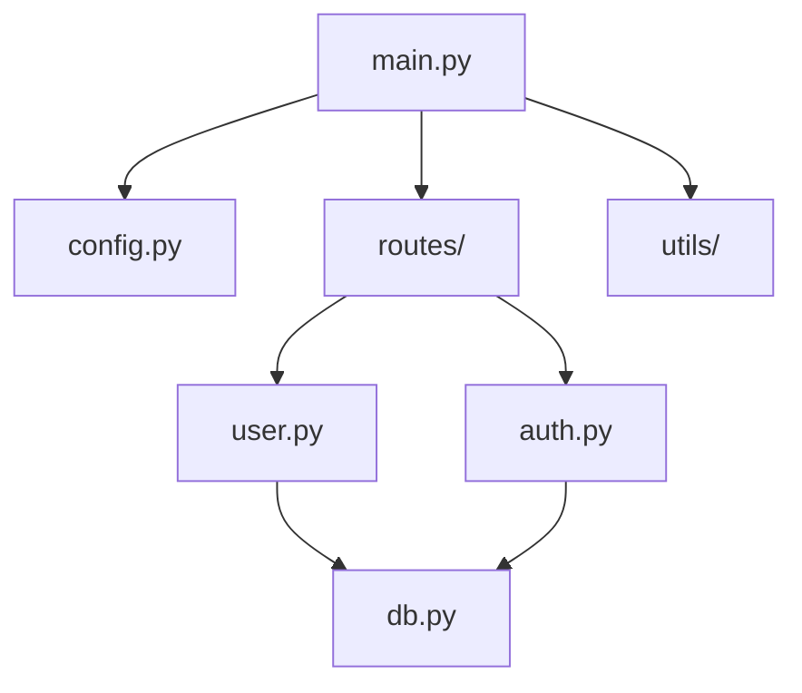

# 文件树 / 模块树 — 渲染规范

两种用途：文件树（scan 第一步的目录结构）和模块树（模块间的包含/依赖关系）。

---

## 文件树（目录结构）

用 `tree` 命令或等价工具输出纯文本，嵌入 HTML `<pre>` 块。

### 截断规则

大项目（>200 文件）：
1. 先完整输出根目录 + 第一层子目录
2. 对关键目录（`src/`、`lib/`、`cmd/`、`app/`）展开到第二层
3. 其他目录只显示第一层
4. 标注「省略 xx 个文件」
5. 省略 `node_modules/`、`.git/`、`__pycache__/`、`dist/`、`build/`、`target/`

### 标记

在 tree 输出中用注释标记关键文件：

```
src/
├── main.py          ← 入口
├── config.py        ← 配置
├── routes/
│   ├── user.py      ← 用户路由
│   └── auth.py      ← 认证路由
└── utils/
    ├── db.py        ← 数据库连接
    └── logger.py    ← 日志
```

HTML 嵌入方式：

```html
<div class="code-annotated">
  <div class="code-label">项目文件树</div>
  <pre><code>src/
├── main.py          ← 入口
├── config.py        ← 配置
...</code></pre>
  <div class="code-note">已省略 node_modules/、.git/ 等自动生成目录（共省略 xx 个文件）</div>
</div>
```

---

## 模块树（依赖关系）

用 Mermaid 画模块间的包含/依赖关系，通过 `scripts/render-mermaid.mjs` 渲染为 SVG 后内联到 HTML。

### 渲染流程

```
1. agent 写 Mermaid 代码到临时文件 scripts/tmp.mmd
2. 执行: node scripts/render-mermaid.mjs --input scripts/tmp.mmd
3. stdout 输出 SVG 字符串
4. agent 把 SVG 直接粘进 HTML
5. 删除临时文件
```

也可以不写文件，直接通过 stdin 传入：

```bash
echo 'graph TD; A-->B' | node scripts/render-mermaid.mjs
```

### 首次使用

脚本会自动检测 `beautiful-mermaid` 是否已安装，没有就自动 `npm install`。

### 适用场景

| 场景 | 渲染方式 | 原因 |
|---|---|---|
| 模块包含关系（<15 节点） | **Mermaid** | `flowchart TD` 自动生成布局 |
| 模块包含关系（15+ 节点） | **SVG 手绘** | 节点多时 Mermaid 布局会重叠 |
| 调用关系图 | **SVG 手绘** | 需要精确控制节点位置（见 `callgraph.md`） |
| 数据流图 | **SVG 手绘** | 需要精确控制每步位置 |

### Mermaid 语法速查

模块依赖树：



节点形状：
- `[文本]` — 矩形（模块）
- `(文本)` — 圆角矩形
- `{文本}` — 菱形（判断/分支）
- `((文本))` — 圆形

连线：
- `-->` — 实线依赖
- `-.->` — 虚线（可选依赖）
- `-- 文本 -->` — 带标签的连线（如 "调用"）

### 与 SVG 的分工

| 特性 | Mermaid | 手写 SVG |
|---|---|---|
| 布局 | 自动（力导向） | 手动坐标 |
| 修改成本 | 改文本即可 | 改坐标 |
| 精确控制 | 低 | 高 |
| 适合场景 | 模块包含/依赖树 | 调用链、数据流 |
| 代码量 | 10-20 行 | 50-100+ 行 |

**规则**：拓扑类图（谁包含谁、谁依赖谁）用 Mermaid，精确布局图（调用链、数据流）用 SVG。
